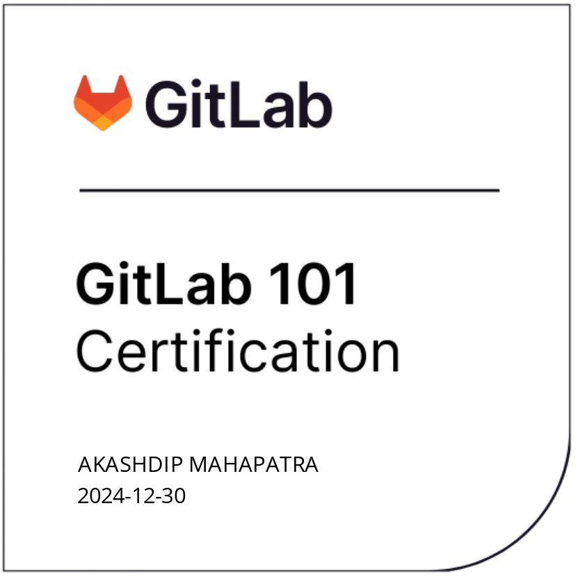

 

Here’s a summary of what you learned from the challenge:

---

### GitLab Merge Request Workflow Learnings

1. **Reviewing Merge Requests:**
   - **Changes Tab**: The **Changes** tab is where you can review all the modifications made in the merge request (MR). This tab allows you to view and edit the changes, ensuring the code changes are correct before merging.

2. **Naming Convention for Target Branch:**
   - **Branch Naming Syntax**: Proper syntax for naming branches involves using lowercase letters and separating words with dashes (e.g., `update-certification-page`, `create-gitlab-certification`). Avoid spaces or special characters to maintain clarity and consistency.

3. **Changing MR Details:**
   - **Editable Fields**: After a merge request is created, you can still change the assignee, milestone, time tracking, and labels. This flexibility allows you to modify MR metadata without affecting the code itself.

4. **Permissions for Merging MRs:**
   - **Developer Role**: A **Developer** has the necessary permissions to merge a merge request. This role is crucial for making contributions and ensuring that code changes are successfully integrated into the main codebase.

5. **Impact of Submitting a Merge Request:**
   - **Merge Request Behavior**: Submitting a merge request doesn’t make any changes immediately. It’s a request to merge, and the changes only take effect once the merge request is reviewed and approved. This ensures a safe review process and avoids unintended code changes.

---

### Key Takeaways:
- You can review and edit changes within the MR using the **Changes** tab.
- Proper branch naming is important for readability and organization.
- You can update the MR details after creation, such as the assignee or milestone.
- **Developers** have the necessary permissions to merge MRs.
- Submitting an MR is safe and doesn’t directly affect the code until it’s approved.

---

---

#### **1. A GitLab __________ is the fundamental medium for collaborating on ideas and planning work in GitLab.**  
- **A. Merge Request** ❌  
- ✅ **B. Issue**  
- **C. Commit** ❌  
- **D. Contribute** ❌  

---

#### **2. What formatting would you use to add a link to an Issue or Merge Request? (Hint: Use the Markdown Guide)**  
- **A. (linked text) [URL]** ❌  
- **B. *linked text*_URL_* ** ❌  
- ✅ **C. [linked text] (URL)**  
- **D. #linked text#*URL* ** ❌  

---

#### **3. What are the different ways you can collaborate with your team on a merge request?**  
- **A. Emoji Reactions** ❌  
- **B. Comments** ❌  
- **C. Code Suggestions** ❌  
- **D. Tagging Collaborators** ❌  
- ✅ **E. All of the above**  

---

#### **4. Why do we utilize markdown for writing content in the GitLab handbook?**  
- ✅ **A. Lightweight markup languages have a simplified and unobtrusive syntax, designed to be easily written within any text editor.**  
- **B. Most team members already know how to use markdown** ❌  
- **C. It's easy to learn and even easier to use** ❌  

---

#### **5. Which definition properly defines the term Source Code?**  
- **a. used for entering data into, and displaying or printing data from, a computer or a computing system.** ❌  
- ✅ **b. a text listing of commands to be compiled or assembled into an executable computer program.**  
- **c. a cryptographic network protocol for operating network services securely over an unsecured network.** ❌  
- **d. denoting software for which the original source code is made freely available and may be redistributed and modified.** ❌  

---

#### **6. What are the benefits of using Git?**  
- ✅ **a. It allows coordinated work among teams and the ability to track changes in any set of files.**  
- **b. It shortens the systems development life cycle and provides continuous delivery with high software quality.** ❌  
- **c. It allows teams to track issues and merge requests created to achieve a broader goal in a certain period of time.** ❌  
- **d. As a lightweight markup language with plain-text-formatting syntax, its design allows it to be converted to many output formats.** ❌  

---

#### **7. What symbols would you use to make something italic? (Hint: Use the Markdown Guide)**  
- **a. **GitLab** ** ❌  
- **b. ## GitLab** ❌  
- **c. [GitLab]** ❌  
- ✅ **d. _GitLab_**  

---

#### **8. I would create a(n) ___________ if I wanted to make a change to the handbook.**  
- **a. Issue** ❌  
- ✅ **b. Merge Request**  
- **c. Email** ❌  
- **d. SSH Key** ❌  

---  

---

1. **When reviewing an MR, which tab would you click on to see what changes you made or add more changes into your merge request?**

   - **Answer**: ✅ **Changes**
   - **Explanation**: The **Changes** tab displays the file changes made in the merge request, including new changes or modifications. You can view and modify the changes directly in this section.

2. **Select all options that use the proper syntax for naming a `target branch`:**

   - **Answer**: ✅ **a. update-certification-page**  
   ✅ **c. create-gitlab-certification**  
   ✅ **d. add-total-rewards-page**
   - **Explanation**: Proper branch names use lowercase letters and dashes to separate words, making them readable and clear. Branch names should avoid spaces or special characters like periods or capital letters.

3. **Can you change the assignee, milestone, time tracking, and labels after the merge request has already been created?**

   - **Answer**: ✅ **Yes**
   - **Explanation**: You can update details like assignee, milestone, time tracking, and labels even after a merge request has been created.

4. **What level of access does someone need to have to be able to merge a Merge Request?**

   - **Answer**: ✅ **Developer**
   - **Explanation**: A **Developer** has permission to merge a merge request, assuming no additional restrictions have been set by the project maintainers.

5. **I won't break anything by just submitting a merge request, because it is a "request to merge" and doesn't make any changes immediately.**

   - **Answer**: ✅ **True**
   - **Explanation**: A merge request is just a request to merge changes into the main branch. It does not apply any changes until reviewed and approved.

---
