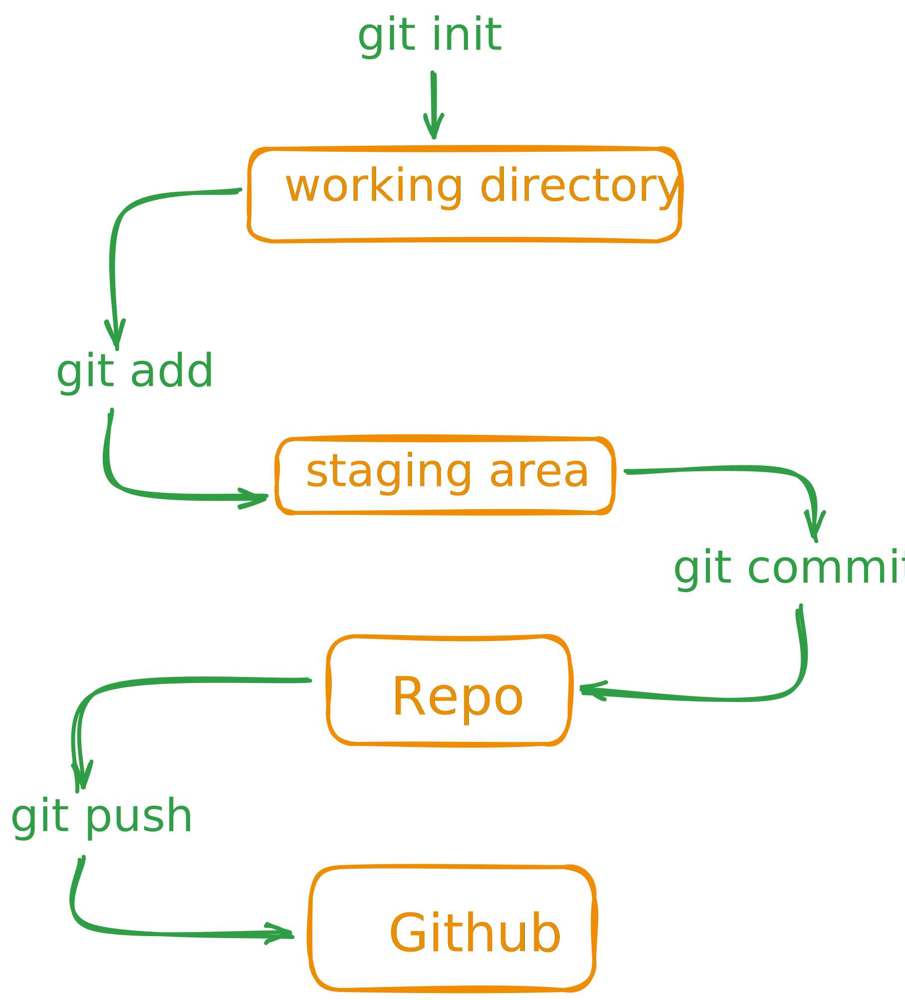
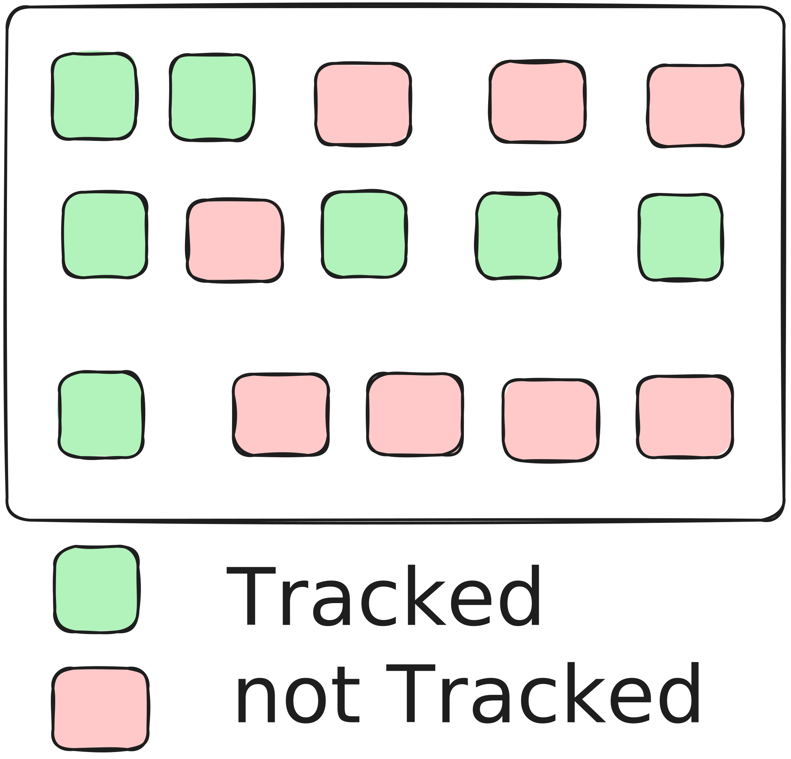
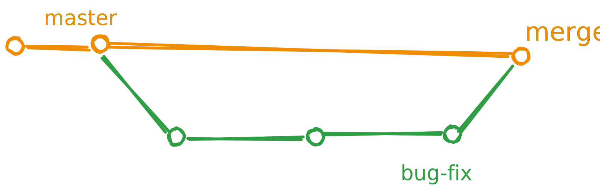

 

# Git & GitHub: Essential Commands

| 🔭 [**my website**](https://akashdip2001.github.io/linktree/) | [Git docs.](https://docs.chaicode.com/git-and-github/) | [ My YouTube Channel](https://www.youtube.com/c/akashaot) |
| --- | --- | --- |

| [Exams MCQ](./Exam/1%20github%20foundations%20certification/readme.md) |
| --- |

---

<div style='display:flex; align-items:center; gap: 30px;' align='center'>
<a href="https://www.credly.com/go/6C69ZOKh"></a>
<a href="https://www.linkedin.com/posts/akashdip2001_postman-api-certification-activity-7264947968200368128-MHWG"></a>
<a href="https://www.credly.com/badges/998c7f5e-7081-4cd7-b8ee-153ece4d89f0/public_url"></a>
<a href="https://ti-user-certificates.s3.amazonaws.com/72109ec1-52dd-4663-9df4-754a8a1d0bff/b3a9ea05-0814-405b-976d-3d150fd56bad-akashdip-mahapatra-f1f2d132-53f4-47fc-b401-7ec7b0e76a62-certificate.pdf"></a>
</div>

</br>

---

## **Table of Contents**

 

1. [Install Git & VS Code](#install-git--vs-code)
2. [Check Git Installation](#check-git-installation)
3. [Configuring Git (Terminal)](#configuring-git-terminal)
      - [UserName]()
      - [Email]() 
4. [Create Repository](#create-and-push-local-repository)
     - [Create Local Repository](#create-and-push-local-repository)
     - [Clone & Check Status](#clone-Repository)
       - [Git Status Indicators](#status-indicators)
5. [Add and Commit (Local)](#add-and-commit-local)
   - [Create file]()
   - [git add .]()
   - [git commit]()
   - [Then Modified & commit]() 
6. [Push to Remote Repository on GitHub](#push-upload-to-remote-repository-on-github)
    1. [VS-code & Web-editor ⚠️ Merge Conflicts](https://youtu.be/vArkGr5nzVU)
    2. 🚀 [Update the Git Remote URL]()
8. [Initialize a New Repository](#initialize-a-new-repository)
9. [Branch Commands](#git-branch-commands)
    - [Check the Branch]()
    - [Rename a Branch]()
    - [Create a New Branch]()
    - [Check all existing Branches]()
    - [Navigate Between Branches]()
    - [Delete a Branch]()
10. [Merging Code](#git-merging-code)
11. [GitHub Exam](./Exam/1%20github%20foundations%20certification/readme.md)

---

## Install Git & VS Code

### Just copy & paste the code into your PowerShell - Done ✔️

You can install Git Bash using Chocolatey, a package manager for Windows. If you haven't installed Chocolatey yet, run the following command in PowerShell with administrative privileges:

```powershell
Set-ExecutionPolicy Bypass -Scope Process -Force; `
[System.Net.ServicePointManager]::SecurityProtocol = `
[System.Net.ServicePointManager]::SecurityProtocol -bor 3072; `
iex ((New-Object System.Net.WebClient).DownloadString('https://chocolatey.org/install.ps1'))
```

Then, install Git and VS Code:

```powershell
choco install git.install
choco install vscode
```

---

## Check Git Installation

 

```bash
git --version
```
```bash
#check where oyu are?
pwd
```
```bash
#All files & folders
ls
```
```bash
#The folder tracked by git or not ?
git status
```

| [docs](https://docs.chaicode.com/terminology/) |
| --- |

---

## Configuring Git (Terminal)

```bash
git config --global user.name "Your Name"
```
```bash
git config --global user.email "your.email@example.com"
```
```bash
git config --list
```


# 🦖 Create an Repository Locally, Edit, and Push from GitHub <a name="create-and-push-local-repository"></a>

 

```yaml
Main Folder
│
│── Folder 01
└── Folder 02: I want to track this folder
```
```bash
cd Folder 02
```
```bash
git status
```
```bash
git init
```
```yaml
Py Projects
Main Folder
│
│── Folder 01
└── Folder 02
     │
     └── .git: ⚠️
```
## ⚠️ Not showing .git Folder ?
#### Open Vs code -> Settings -> Exclud -> Remove Git from here.

<details>	
 <summary><b>image Guide </b></summary><br>
<div style='display:flex; align-items:center; gap: 10px;' align='center'>
<p align="center">
  
  
</p>
</div>
</details>


# Or, 🦖 Clone an Existing Repository Locally, Edit, and Push from GitHub <a name="clone-Repository"></a>

---

## Clone and Check Status

```bash
git clone https://github.com/username/repository.git
```

```bash
git status
```

### Status Indicators

Here’s a comprehensive table summarizing the states and their short indicators in Git, along with descriptions:

| **State**        | **Short Indicator** | **Description**                                                                                     | **Icon**                       |
|-------------------|---------------------|-----------------------------------------------------------------------------------------------------|--------------------------------|
| **Untracked**    | `??`               | Files that Git doesn't track yet. They are new and need to be added `git add .` to start tracking. | *(No specific icon provided)* |
| **Modified**     | `M`                | Files that have been changed but are not yet staged for commit.                                    |  |
| **Staged**       | `A` or `M`         | Files added to the staging area. `A` for newly added, `M` for modified files staged for commit.    |  |
| **Unmodified**   | *(none)*           | Files that are tracked and have not been modified; they remain in their last committed state.      | *(No specific icon provided)* |
| **Unmerged**     | `U` (or `UU`)      | Files with conflicts during a merge; need resolution before completing the merge.                  |  | 

- `UU` for a file that is unmerged with conflicts.
- `AA`, `DD`, etc., for specific merge conflict cases (e.g., both sides added or deleted a file).


## Add and Commit (Local)


### ✈️ Create new file --> add & commit

```bash
touch "file 01" "file 02"
```
```yaml
Py Projects
Main Folder
│
│── Folder 01
└── Folder 02
     │
     │── .git:
     │── file 01
     └── file 02
```
```bash
# git add filename_01.txt filename_02.txt
git add .
```
<details>	
 <summary><b>New file add . </b></summary>
     
</details>

<details>	
 <summary><b>Again create a New file  & commit all</b></summary>
     
     
</details>

*Use `git add .` to add all changes.*

```bash
git commit -m "1st commit"
```
---

### ✈️ Modified (edit) any file --> **again** add & Commit again

<p align="center">
  
  
</p>

<details>	
 <summary><b>Next img </b></summary>
     
     
     
</details>

*Again Use `git add .` to add all changes.*
```bash
git add filename_02.txt
```

```bash
git commit -m "2nd commet after modified a file"
```
<p align="center">
     
</p>


## Push (Upload to Remote Repository on GitHub)

[](https://www.youtube.com/watch?v=BXR_HoROl3E)

<details>	
 <summary><b>⚠️⚠️⚠️ VS-code & Web-editor ❌ Merge Conflicts ⚠️⚠️⚠️ </b></summary><br>
<div style='display:flex; align-items:center; gap: 10px;'>

[](https://www.youtube.com/watch?v=mryez-QqMj4)

### ⚠️ I have a github propository in the github. And I clone this repository using http URL, so I directly push my all changes through VS code. But what happened eat I open Github web editor and modify any file and push from it. This time how to sync my geethab with vs code in this two cases - case1 - if my I not work on vs good and there was no modified or changes. And in case2 - what happened I update from GitHub web editor but there was also some modification exist in v.s code which is comet but not push ⚠️

### ✅ Solution ✅

To synchronize your local repository (in VS Code) with the remote GitHub repository in both cases, follow these steps:

---

### ✅ **Case 1: No Local Changes in VS Code**
You updated a file in the GitHub web editor, but no changes were made in your local repository.

1. **Pull the Latest Changes**:
   - Open the terminal in VS Code or use the Source Control tab.
   - Run:
     ```bash
     git pull origin <branch_name>
     ```
   - Replace `<branch_name>` with the branch you are working on (e.g., `main` or `master`).

2. **Confirm Sync**:
   - After pulling, your local repository will now match the remote repository since there were no local changes to cause a conflict.

---

### ✅ **Case 2: Local Changes in VS Code Not Pushed Yet**
You updated a file in the GitHub web editor and also made changes locally that are committed but not pushed.

1. **Pull the Latest Changes**:
   - First, fetch and merge the remote changes using:
     ```bash
     git pull origin <branch_name>
     ```

2. ⚠️ **Resolve Merge Conflicts (if any)**:
   - If there are conflicts between the changes made locally and those from the GitHub web editor, Git will indicate the files with conflicts. Resolve these conflicts by:
     - Opening the conflicted files in VS Code.
     - Looking for conflict markers (`<<<<<<<`, `=======`, `>>>>>>>`).
     - Deciding whether to keep your changes, the remote changes, or both.
   - After resolving the conflicts, stage the resolved files:
     ```bash
     git add <file_name>
     ```
   - Commit the resolved changes:
     ```bash
     git commit -m "Resolved merge conflicts"
     ```

3. **Push Your Changes**:
   - Once the merge is complete and there are no conflicts, push your changes back to the remote repository:
     ```bash
     git push origin <branch_name>
     ```

---

### **Notes**
- Always pull the latest changes before starting work in VS Code to minimize conflicts.
- Use `git status` frequently to check the state of your repository and understand whether changes are staged, unstaged, or committed.
- If you only want to review the changes made in the GitHub web editor before pulling, use:
  ```bash
  git fetch origin <branch_name>
  git log origin/<branch_name>
  ```
[](https://www.youtube.com/watch?v=vArkGr5nzVU)


#### ✅ This approach keeps both your local and remote repositories in sync efficiently. ✅

</div>
</details>

### Push Changes to a Remote Repository

Once you've committed your changes locally, use the `git push` command to push those changes to a remote repository.

**Syntax:**

```bash
git push <remote_name> <branch_name>
```

**Example:**

```bash
git push origin main
```

*Replace `origin` with the name of your remote repository, and `main` with the name of the branch you're pushing to.*

If it's your first time pushing to the remote repository, you may need to set up tracking:

```bash
git push -u origin main
```

*After the initial setup, simply use `git push` for future pushes.*

```bash
git push
```

🚥🚥🚥🚥🚥🚥🚥🚥🚥🚥🚥🚥🚥🚥🚥

## Update the Git Remote URL

🚥🚥🚥🚥🚥🚥🚥🚥🚥🚥🚥🚥🚥🚥🚥
### 1. 🚀 git clone from a another profile/repo
   

### 2. 🚀 Check the Targate repo
   

### 3. 🚀 Update the Targate repo

####  Step 1: Update the Git Remote URL
In the `node-todo-cicd` directory, update the remote URL to point to your repository:

```bash
git remote set-url origin https://github.com/akashdip2001/AWS.git
```

Verify the change with:

```bash
git remote -v
```

It should now display:

```plaintext
origin  https://github.com/akashdip2001/AWS.git (fetch)
origin  https://github.com/akashdip2001/AWS.git (push)
```

---

### Step 2: Move the Files to the Target Directory
1. Create the directory structure in your repository:

   ```bash
   mkdir -p Projects/CI-CD/Project\ 001
   mv * Projects/CI-CD/Project\ 001/
   ```

2. Ensure no unnecessary files (e.g., `.git` from the original project) are moved:

   ```bash
   rm -rf Projects/CI-CD/Project\ 001/.git
   ```

---

### Step 3: Stage and Commit the Changes
1. Add the new directory and its content to the staging area:

   ```bash
   git add Projects/CI-CD/Project\ 001/
   ```

2. Commit the changes with an appropriate message:

   ```bash
   git commit -m "Added node-todo-cicd project to Projects/CI-CD/Project 001"
   ```

---

### Step 4: Push the Changes
Push the changes to your repository on GitHub:

```bash
git push origin master
```

Replace `master` with the branch name you're using if it differs.

---

### Step 5: Verify the Upload
1. Go to your repository on GitHub: [https://github.com/akashdip2001/AWS](https://github.com/akashdip2001/AWS).
2. Navigate to `Projects/CI-CD/Project 001` to ensure the files are correctly placed.

---

This method ensures the project is correctly uploaded to the desired directory in your repository.


🚥🚥🚥🚥🚥🚥🚥🚥🚥🚥🚥🚥🚥🚥🚥
---
---

## Initialize a New Repository

**`init`** - Used to create a new repository

```bash
mkdir <NewFolderName>
cd <NewFolderName>
git init
```

*Use `cd ..` to navigate back to the main folder.*

*`mkdir` creates a new folder and `cd` enters it. Then, create or edit files within the folder.*

```bash
git status
git add .
git commit -m "Initial commit"
git status
```

```bash
git push origin main
```


# 🦖 Creating a Repository on GitHub (Without README) & Uploading Local Files

**Without a README**: This allows you to clone the repository locally, initialize Git, and push all local files.


```bash
git remote add origin https://github.com/username/repository.git
git remote -v
```

*Use `git remote -v` to verify the remote connection.*

## Check the Branch

```bash
git branch
```

*If you're on the `master` branch, rename it to `main`.*

### Rename the Branch to `main`

```bash
git branch -M main
git push -u origin main
```

*The `-u` flag sets up tracking for future pushes, allowing you to use `git push` without specifying the remote and branch.*

## Push Any Changes Locally

```bash
git status
git add .
git commit -m "Add new file or update"
git push
```


# 🦖 Branch Commands <a name="git-branch-commands"></a>

<p align="center">
     
</p>

### ✈️ Check the Branch

```bash
git branch
```

### ✈️ Rename a Branch

```bash
#git branch -M main
git branch -m <old-branch-name> <new-branch-name>
```

### ✈️ Create a New Branch

```bash
git branch <new-branch-name>
```
```bash
git checkout -b <new-branch-name>
```

### ✈️ Check all existing Branches
```bash
git branch
```
<details>	
 <summary><b>also check using HEAD file</b></summary>
     
     
</details>

### ✈️ Navigate Between Branches
```bash
# create new Branch Then switch
git branch <branch-name>
```
```bash
git switch <branch-name>
```
```bash
git checkout <branch-name>
```
```bash
# Auto create the branct (if not exist) & switch
git switch -c <branch-name>
```

### ✈️ Delete a Branch

```bash
git branch -d <branch-name>
```

### ✅ After Making Changes

```bash
git status
git add .
git commit -m "Your commit message"
git push origin <branch-name>
```
|  [docs](https://docs.chaicode.com/branches-in-git/) |
| --- |

## Create a new Branch in VS-Code ⚠️ git push

<details>	
 <summary><b>steps </b></summary>
      


```bash
git branch
```
```bash
git branch "Test-Share-link"
```
```bash
git switch "Test-Share-link"
```
```bash
git branch
```
```bash
git status
```
```bash
git add .
git commit -m "add Test-Share-link .md file"
# ❌ git push
```
```bash
# ✅
git push --set-upstream origin Test-Share-link
```


</details>


# 🦖 Merging Code <a name="git-merging-code"></a>

## Method 1: Using Git Commands

 

```bash
#git diff <branch-name>   # Compare commits, branches, files & more
git merge <branch-name>
```

<details>	
 <summary><b>GUI</b></summary>
     
</details>

## Method 2: Creating a Pull Request (PR)

```bash
git pull origin main    # Download and synchronize with GitHub
```


---

| 📄 [Documentation](https://docs.chaicode.com/git-and-github/) |   [My YouTube Channel](https://youtu.be/q8EevlEpQ2A?si=AFDUT-cTa-OXjufz&t=6370) |
| --- | --- |

---

# [GitHub Exam](./Exam/1%20github%20foundations%20certification/readme.md)


